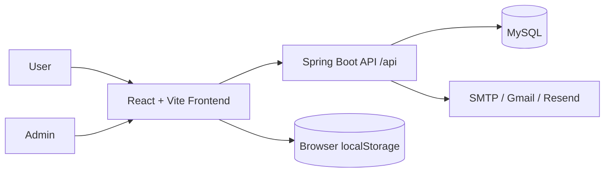
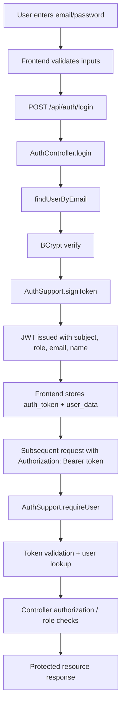

# Zyndex Audit

Date: 2026-08-24

## 1. Project Overview

### Identity and purpose
- Project name: Zyndex
- Project purpose: Educational resource platform for browsing, searching, downloading, favoriting, and managing digital learning resources; includes admin resource management and user authentication.
- Main problem solved: It provides a library-like portal where users can access educational resources, admins can upload/manage content, and the system tracks usage, ratings, and feedback.
- Current project type: Hybrid/transitioning application, but functionally a monolithic web app.
- Frontend technology: React 18 with Vite, React Router, custom page components, Tailwind styling, Motion, Radix UI primitives, MUI components.
- Backend technology: Active Spring Boot backend in `spring-backend/` using Java 21, Spring Boot 3.5.7, JDBC via `JdbcTemplate`, MySQL.
- Database technology: MySQL, configured with JDBC and schema created at startup.
- Authentication technology: JWT-based authentication in the active Spring backend, plus bcrypt password hashing. The repo also contains a legacy Express backend using `jsonwebtoken` and `bcryptjs`.
- Major libraries/frameworks: React, Vite, React Router, Tailwind, Radix UI, MUI, Axios, Motion, Spring Boot, JJWT, BCrypt, MySQL connector, JavaMail.
- Build tools: Maven (`spring-backend/pom.xml`), Vite (`package.json`), npm.
- Runtime versions identifiable: Java 21 (`spring-backend/pom.xml`), Spring Boot 3.5.7, React 18.3.1, Vite 6.3.5, Node package versions in root `package.json`, JJWT 0.12.6, Node `jsonwebtoken` 9.0.2 in the legacy backend.
- Deployment configuration: Netlify (`netlify.toml`) and Vercel (`vercel.json`) are present for frontend hosting. Spring Boot backend docs describe Maven packaging and jar startup; no Dockerfile or compose file exists in the inspected project.

### Architecture classification
- Determination: Hybrid / transitional, but not microservices.
- Reasoning:
  - The active app is a single frontend plus a single Spring Boot backend plus one MySQL database.
  - `spring-backend/src/main/java/com/zyndex/backend` contains controllers, utility classes, and startup configuration, but no separate microservice modules.
  - There is a second legacy Express backend in `backend/` which indicates migration or duplication, but it is not a microservices architecture.
  - There are no service discovery components (Eureka), no API gateway, no separate modules for Auth/Content/Access/Usage, and no inter-service network logic.

---

## 2. Complete Project Structure

### Primary structure
- Root project: `index.html`, `package.json`, `README.md`, `vite.config.ts`, `vercel.json`, `netlify.toml`, `postcss.config.mjs`, `.env.example`.
- Frontend root: `src/`
- Active backend: `spring-backend/`
- Legacy backend: `backend/`

### Frontend directories
- `src/main.tsx`: app bootstrap.
- `src/app/routes.jsx`: main React Router route config.
- `src/app/context/AuthContext.jsx`: authentication context, token persistence, role state.
- `src/app/components/`: layout and route guard components (`ProtectedRoute.jsx`, `UserLayout.jsx`, `AdminLayout.jsx`, `RootLayout.jsx`, etc.).
- `src/app/pages/`: public pages and protected user/admin pages.
- `src/services/api/`: API client and service modules (`apiClient.js`, `authService.js`, `resourceService.js`, `userService.js`, `feedbackService.js`).
- `src/styles/` and `src/app/styles`: styling assets.

### Active backend directories
- `spring-backend/src/main/java/com/zyndex/backend/`
  - `ZyndexSpringBackendApplication.java`: Spring Boot app entrypoint.
  - `AppProperties.java`: configuration properties record for `zyndex.*`.
  - `DbInitializer.java`: schema bootstrapping and seed admin creation.
  - `AuthController.java`: register/login/me/password/reset endpoints.
  - `AuthSupport.java`: JWT generation/validation, user lookup, sanitization, BCrypt handling.
  - `UserController.java`: user profile, favorites, downloads, admin user management.
  - `ResourceController.java`: resource listing, upload, metadata, download, rating, tracking.
  - `FeedbackController.java`: feedback and contact submission; admin review endpoints.
  - `OtpController.java`: OTP generation and verification with SMTP/Gmail/Resend.
  - `AccountEmailService.java`: signup confirmation email service.
  - `GlobalExceptionHandler.java`: centralized error handling.
  - `WebConfig.java`: CORS and upload static resource serving.
  - `SqlSupport.java`: pagination and DB type mapping helper.
  - `HealthController.java`: health endpoint.

### Legacy backend directories
- `backend/src/app.js`: Express app with middleware, static uploads, route registration.
- `backend/src/config/db.js`: MySQL initialization, schema bootstrap, admin creation, DB migration steps.
- `backend/src/controllers/`: Express controllers for auth, users, resources, feedback, OTP.
- `backend/src/routes/`: route registration for `/api/auth`, `/api/users`, `/api/resources`, `/api/feedback`, `/api/send-otp`.
- `backend/src/middleware/auth.js`: JWT verification and role enforcement.
- `backend/src/utils/auth.js`: JWT generation and user sanitization.
- `backend/sql/schema.sql`: database schema definitions.

### Database and data model
- The active Spring backend does not use JPA entities or repositories. It uses raw SQL with `JdbcTemplate` and schema created in `DbInitializer.java`.
- Tables created by `DbInitializer.java`: `users`, `resources`, `downloads`, `saved_resources`, `resource_views`, `feedback`, `admin_requests`, `contacts`, `password_reset_requests`.
- Legacy backend also uses a `schema.sql` file for the same general database structure.

### Notable configuration and deployment files
- `spring-backend/src/main/resources/application.yml`: backend runtime config, datasource, upload directory, mail, JWT secret, frontend URL.
- `.env.example`: frontend env variable for `VITE_API_BASE_URL`.
- `README.md`: root documentation for local development and deployment.
- `spring-backend/README.md`: Spring backend setup and env variables.
- `netlify.toml`: frontend static hosting redirect.
- `vercel.json`: frontend rewrite.

---

## 3. Technology Stack

| Technology | Version | Where Used | Evidence/Location | Status |
|---|---|---|---|---|
| Java | 21 | Active backend | `spring-backend/pom.xml` (`<java.version>21</java.version>`) | Verified |
| Spring Boot | 3.5.7 | Active backend | `spring-backend/pom.xml` (`spring-boot-starter-parent` version `3.5.7`) | Verified |
| Spring Security | Not verified as full framework usage | Active backend | No `SecurityFilterChain`, `@EnableWebSecurity`, `@EnableMethodSecurity`, or `WebSecurityConfigurerAdapter` found in `spring-backend/src/main/java` | Not implemented in practice |
| Spring Data JPA | Not used | Active backend | No `spring-boot-starter-data-jpa` dependency; no `@Entity`, `JpaRepository`, or repository interfaces found | Not implemented |
| Hibernate | Not used | Active backend | No JPA/Hibernate dependencies or entity mappings found | Not implemented |
| Maven | Project build tool | Active backend | `spring-backend/pom.xml` and `./mvnw` wrapper | Verified |
| Node.js | Not verified exactly | Legacy backend / frontend tooling | `backend/package.json` and root `package.json` indicate Node usage | Verified by package manifests |
| React | 18.3.1 | Frontend | Root `package.json` (`react` and `react-dom` versions) | Verified |
| Vite | 6.3.5 | Frontend | Root `package.json`, `vite.config.ts` | Verified |
| TypeScript/JavaScript | JS + TS mixed | Frontend | `src/main.tsx`, TSX files, JSX files, `vite.config.ts` | Verified |
| Tailwind | 4.1.12 | Frontend styling | Root `package.json`, `src/styles/tailwind.css` | Verified |
| MySQL | Not explicitly versioned | Database | `spring-backend/src/main/resources/application.yml` and `backend/src/config/db.js` | Verified by configuration |
| JWT (Spring) | JJWT 0.12.6 | Active backend auth | `spring-backend/pom.xml` and `AuthSupport.java` | Verified |
| JWT (legacy Node) | jsonwebtoken 9.0.2 | Legacy backend | `backend/package.json` and `backend/src/utils/auth.js` | Verified |
| BCrypt/password hashing | `spring-security-crypto` and `BCryptPasswordEncoder` | Active backend | `AuthSupport.java`, `DbInitializer.java`; legacy uses `bcryptjs` | Verified |
| REST API | Used | Frontend/backend | Spring controllers and Express routes define REST endpoints | Verified |
| Axios | ^1.13.4 | Frontend API calls | `src/services/api/apiClient.js` and root `package.json` | Verified |
| WebSocket | Not found | N/A | No websocket implementation found in repo | Not implemented |
| Docker | Not found | N/A | No `Dockerfile`, `docker-compose.yml`, or deployment compose file in inspected repo | Not implemented |
| Cloud/deployment | Vercel + Netlify | Frontend hosting | `vercel.json`, `netlify.toml` | Verified |
| Testing frameworks | Spring Boot test support only | Backend tests | `spring-backend/pom.xml`, `ZyndexSpringBackendApplicationTests.java` | Partially present |

---

## 4. Backend Architecture

### Overall backend architecture
The active backend is a classic JDBC-based Spring Boot application using:
- `JdbcTemplate` for database access
- controllers for HTTP endpoints
- utility/service-style support classes for token handling and validation
- one-time schema bootstrapping in `DbInitializer`
- no entities, repositories, or JPA domain layer

This is not a layered `Controller -> Service -> Repository` pattern in the strict Spring Data sense. It is closer to:
- `Controller -> Utility/Support -> JdbcTemplate -> MySQL`

### Package structure and code organization
`spring-backend/src/main/java/com/zyndex/backend` contains functional classes in a single package, with minimal separation. It follows a simple monolithic style rather than a full DDD or layered architecture.

### Controller layer
Relevant controllers:
- `AuthController.java`: registration, login, logout, `me`, password reset, admin request.
- `UserController.java`: user profile, favorites, download history, admin user management.
- `ResourceController.java`: resource CRUD, search, listing, category stats, download, track, rating.
- `FeedbackController.java`: feedback submission, contact message handling, admin feedback review.
- `OtpController.java`: OTP generation and verification, SMTP/Gmail/Resend logic.
- `HealthController.java`: service health endpoint.

### Service layer
There is no full dedicated service layer in the Spring architecture. The nearest equivalents are:
- `AuthSupport.java`: authentication and user operations
- `AccountEmailService.java`: email confirmation logic
- `SqlSupport.java`: data mapping and pagination helpers
- `DbInitializer.java`: startup DB init and main admin bootstrap

### Repository layer
Not implemented as a repository abstraction.
- No `JpaRepository` interfaces
- No `CrudRepository` interfaces
- No `@Entity` classes
- Database access is direct via `JdbcTemplate`

### Entity/model layer
Not implemented as persistent entity classes.
- No `User`, `Resource`, `Feedback`, or `Access` entity classes in `spring-backend`
- The app works with `Map<String,Object>` and raw SQL rows.

### DTO layer
Not implemented as structured DTO classes.
- Many controller methods accept/return `Map<String, Object>` instead of typed DTOs.
- This is a lightweight dynamic-JSON approach.

### Exception handling
- `GlobalExceptionHandler.java` handles `ApiException` and generic exceptions.
- `ApiException.java` is a custom exception holder used throughout controllers.
- Error responses are normalized to `{ "message": "..." }`.

### Configuration
- `AppProperties.java`: collects `zyndex.*` properties.
- `application.yml`: database, mail, JWT, upload config.
- `WebConfig.java`: CORS and static file serving.

### Utility classes
- `AuthSupport.java`: JWT generation/validation, user sanitization, `BCryptPasswordEncoder`, string helpers.
- `SqlSupport.java`: pagination and DB type conversion.
- `HealthController.java`: simple lifecycle check.

### Legacy Node backend architecture
The `backend/` directory is a second, older Express implementation that mirrors the same endpoints and the same DB semantics. It uses:
- Express app
- MySQL pool
- JWT middleware
- route/controller separation
- `bcryptjs`
- `multer` for uploads

It is not the active frontend API path but is still a valid part of the repo and indicates a previous implementation approach.

---

## 5. Frontend Architecture

### Framework and routing
- Framework: React 18 with Vite
- Router: `react-router` via `src/app/routes.jsx`
- Route structure: public pages, then protected admin and user routes using `ProtectedRoute.jsx`

### Important frontend files
- `src/app/context/AuthContext.jsx`: central auth state and redirect logic
- `src/app/components/ProtectedRoute.jsx`: protects routes based on `admin` or `user`
- `src/app/components/RootLayout.jsx`: top-level layout wrapper
- `src/app/components/UserLayout.jsx` and `AdminLayout.jsx`: role-specific shell layouts
- `src/services/api/apiClient.js`: global Axios instance and token injection logic
- `src/services/api/*`: domain-specific API service layer

### State management
- Local state in pages/components via `useState` and `useEffect`
- Global auth state via React context (`AuthContext`)
- No Redux, Zustand, or similar global state library was found

### API communication
- `apiClient.js` sets the default base URL to `VITE_API_BASE_URL || 'http://localhost:8080/api'`
- Authorization header is attached as `Authorization: Bearer <token>`
- The app uses `axios` for backend calls
- File downloads use `fetch` instead of `axios` in `resourceService.js`

### Authentication state and protected routes
- Token stored in `localStorage` under `auth_token`
- User stored in `localStorage` under `user_data`
- `AuthContext` hydrates user from token by calling `/auth/me`
- `ProtectedRoute.jsx` checks `authReady`, `isAuthenticated`, and `role`
- Redirects to `/Zyndex/Log-In` if not authorized

### Forms and validation
- Login and sign-up flows in `src/app/pages/Login.jsx`
- Password strength check exists in `src/app/pages/ForgotPassword.jsx`
- Contact and feedback forms exist in pages/components
- Validation is primarily client-side field checks; backend validation is also present

### UI framework and responsiveness
- Tailwind CSS used throughout pages
- Motion animations via `motion/react`
- MUI and Radix components used for some UI elements.
- Responsive behavior is implemented with utility classes and layout adjustments, not a separate design system package.

### File upload/download functionality
- Resource upload via admin resource management pages; API endpoint `POST /api/resources` with multipart `FormData` and `file` field.
- Download via `GET /api/resources/{id}/download` in Spring backend.
- `resourceService.js` implements file download and external file handling.

### Important user workflows
- User sign-up/login → OTP verification → role-based dashboard
- Browse categories and search by title/keyword/author
- Favorite resources, recent-view tracking, downloads
- Admin upload/manage resource content
- Admin review feedback, user management, dashboard stats

---

## 6. Authentication and JWT Audit

### Verification status matrix

| Item | Status | Evidence |
|---|---|---|
| Login endpoint | IMPLEMENTED | `AuthController.java` `@PostMapping("/login")`; `backend/src/controllers/authController.js` `login()` |
| Registration endpoint | IMPLEMENTED | `AuthController.java` `@PostMapping("/register")`; `backend/src/controllers/authController.js` `register()` |
| JWT generation | IMPLEMENTED | `AuthSupport.java` `signToken(...)`; `backend/src/utils/auth.js` `signToken(...)` |
| JWT validation | IMPLEMENTED | `AuthSupport.java` `requireUser(...)` and `Jwts.parser().verifyWith(...).parseSignedClaims(...)`; `backend/src/middleware/auth.js` `jwt.verify` |
| JWT claims | IMPLEMENTED | `subject` = user id; claims `role`, `email`, `name`; expiration 7 days in Spring; `sub`, `role`, `email`, `name` in Node |
| Secret/key configuration | IMPLEMENTED | `spring-backend/src/main/resources/application.yml` `zyndex.jwt-secret: ${JWT_SECRET:...}`; `backend/src/config/env.js` `jwtSecret` |
| Token expiration | IMPLEMENTED | Spring: `signToken` uses `expiration(Date.from(now.plusSeconds(7 * 24 * 60 * 60)))`; Node: `expiresIn: "7d"` |
| Token storage on frontend | IMPLEMENTED | `AuthContext.jsx` and `authService.js` store token in `localStorage` under `auth_token` |
| Authorization header format | IMPLEMENTED | `apiClient.js` sends `Authorization: Bearer ${token}` |
| Authentication filter/middleware | IMPLEMENTED (Spring custom, not framework filter chain) | `AuthSupport.requireUser(HttpServletRequest)` manually checks headers; `backend/src/middleware/auth.js` checks `authorization` header |
| Spring Security configuration | NOT IMPLEMENTED as a real security configuration | No `SecurityFilterChain` or `@EnableWebSecurity` in `spring-backend/src/main/java` |
| Password hashing | IMPLEMENTED | `BCryptPasswordEncoder` in `AuthSupport.java`; `bcryptjs` in legacy backend |
| BCrypt usage | IMPLEMENTED | `new BCryptPasswordEncoder()` in `AuthSupport.java` and `DbInitializer.java` |
| Logout behavior | PARTIALLY IMPLEMENTED | both backends return a success message but do not revoke token server-side |
| Refresh token support | NOT IMPLEMENTED | No refresh token generation, endpoint, or rotation logic found |
| Role-based authorization | IMPLEMENTED | `requireRole(user, "admin")` and `requireRole(..., "admin")` in Spring; `requireRole(...roles)` in Node |
| Permissions | PARTIALLY IMPLEMENTED | only `admin` / `user` roles appear; no granular permissions model |
| Protected endpoints | IMPLEMENTED | `AuthController.me`, `UserController.*`, `ResourceController.*`, `FeedbackController.*` enforce auth/admin checks |
| Public endpoints | IMPLEMENTED | auth register/login, resource browse/category/featured, contact/feedback POST endpoints |
| Frontend route protection | IMPLEMENTED | `ProtectedRoute.jsx` and `AuthContext.jsx` |

### Actual login and auth flow
Flow in active Spring backend:
1. Frontend calls `/api/auth/login` from `authService.login()`
2. `AuthController.login()` validates email, password, and optional role
3. `AuthSupport.findUserByEmail(...)` loads user from DB
4. `BCryptPasswordEncoder.matches(...)` verifies password
5. `AuthSupport.signToken(user)` creates JWT with subject + role + email + name and 7-day expiration
6. Frontend stores `auth_token` and `user_data`
7. Subsequent requests include `Authorization: Bearer <token>` via `apiClient.js`
8. `AuthSupport.requireUser(request)` parses token, loads user by ID, verifies active status, and returns sanitized user
9. Controller logic checks `requireRole` when admin-only actions are attempted

### Security notes
- The active JWT logic is custom and effective for a single-service application, but it is not a Spring Security filter chain.
- No token blacklisting/logout invalidation is implemented.
- No refresh token support exists.
- Secret is configured via environment variable `JWT_SECRET` but root app includes a fallback default string: `replace-this-with-a-long-random-secret` in configuration.
- `AuthController.logout()` simply returns a message and does not revoke the client token.

---

## 7. User / Role / Authorization System

### Actual roles found
The code explicitly uses:
- `ADMIN`
- `STUDENT`
- user-facing role normalization to `admin` and `user` in sanitized user data

Evidence:
- `DbInitializer.java`: `role VARCHAR(30) NOT NULL DEFAULT 'STUDENT'`
- `AuthController.java`: user registration inserts `role` as `'STUDENT'`; admin requests create separate admin request records
- `AuthSupport.sanitizeUser(...)`: converts `ADMIN` to `admin`, anything else to `user`
- `ProtectedRoute.jsx`: checks `role === 'admin'` and `role === 'user'`

### Registration and login behavior
- Registration creates a new user with role `STUDENT` unless admin creation is performed in a separate path.
- `AuthController.login()` supports role matching via request body `role` and compares it against sanitized user role.
- Admin access request is handled by `/api/auth/admin-request`.

### Password handling
- `BCryptPasswordEncoder` used in Spring backend
- `bcryptjs` used in legacy backend
- Passwords stored in `users.password`

### Role enforcement patterns
- `AuthSupport.requireRole(Map<String, Object> user, String role)` checks equality
- `UserController` calls `auth.requireRole(auth.requireUser(request), "admin")`
- `ResourceController` admin-only uploads and updates use `auth.requireRole(user, "admin")`
- `FeedbackController` admin-only review endpoints enforce admin role

### Frontend role handling
- `AuthContext.jsx` stores `role` in state and exposes `isAdmin`, `isUser`, `isPrimaryAdmin`
- route protection is based on `ProtectedRoute role="admin"` and `role="user"`

### Permissions system
- Not granular; only coarse role checks exist.
- No explicit `@PreAuthorize`, `GrantedAuthority`, or permission list.

---

## 8. Database Audit

### Database type and configuration
- Database type: MySQL
- Connection configuration: `spring-backend/src/main/resources/application.yml` and `backend/src/config/db.js`
- Datasource URL: `jdbc:mysql://${DB_HOST:localhost}:${DB_PORT:3306}/${DB_NAME:zyndex_db}?createDatabaseIfNotExist=true&allowPublicKeyRetrieval=true&useSSL=false&serverTimezone=UTC`
- Database name if safely available: `zyndex_db` default value in config, but it may be overridden by environment variables
- ORM: Not implemented; uses raw JDBC/`JdbcTemplate`

### Tables and schema
| Entity/Table | Purpose | Important Fields | Relationships | Repository |
|---|---|---|---|---|
| `users` | Core user account records | `id`, `email`, `password`, `username`, `role`, `bio`, `registration_no`, `active` | Referenced by resources, downloads, saved_resources, feedback, resource_views | No repository class; `JdbcTemplate` query direct |
| `resources` | Educational digital resources | `id`, `title`, `category`, `author`, `type`, `file_url`, `downloads_count`, `rating`, `uploaded_by` | `uploaded_by -> users.id` | Direct SQL |
| `downloads` | User download history | `id`, `downloaded_at`, `resource_id`, `user_id` | `resource_id -> resources.id`, `user_id -> users.id` | Direct SQL |
| `saved_resources` | Bookmarks | `resource_id`, `saved_at`, `user_id` | composite key linking user/resource | Direct SQL |
| `resource_views` | Track access/view events | `id`, `resource_id`, `user_id`, `viewed_at` | `resource_id -> resources.id`, `user_id -> users.id` | Direct SQL |
| `feedback` | Ratings and comments | `id`, `rating`, `comment`, `resource_id`, `user_id` | `resource_id -> resources.id`, `user_id -> users.id` | Direct SQL |
| `admin_requests` | Admin access requests | `full_name`, `display_name`, `email`, `password_hash`, `status` | no foreign key | Direct SQL |
| `contacts` | Contact page message storage | `name`, `email`, `subject`, `message` | none | Direct SQL |
| `password_reset_requests` | Reset request logging | `full_name`, `email`, `role`, `previous_password`, `new_password_hash` | none | Direct SQL |

### Relationships and constraints
- Foreign key checks are implemented in `DbInitializer.java` and `backend/src/config/db.js`.
- Cascading delete is present on child rows for several tables.
- `resources.uploaded_by` references `users.id`.
- `downloads` and `saved_resources` contains key relations to user and resource.
- A custom trigger in legacy Node `backend/src/config/db.js` reassigns resources on user deletion.

### Indexes, constraints, migrations
- Explicit indexes are not clearly defined beyond primary keys and foreign keys.
- Startup bootstrapping is done in `DbInitializer.java` and `backend/src/config/db.js` ; no dedicated migration framework is present.
- There are schema creation blocks and runtime patch/alter statements like `ensureResourceUpdateTracking()` and `ensureUserRelationshipSafety()`.

### Seed data
- A main admin account is created at startup by `DbInitializer.java` and `backend/src/config/db.js`.
- Admin email/password are sourced from env properties (`MAIN_ADMIN_EMAIL`, `MAIN_ADMIN_PASSWORD`, `MAIN_ADMIN_NAME`).

### Usage verification
- The database schema is actively used by the Spring backend controllers: login, resource listing, ratings, profile pages, feedback, and admin stats all query these tables.
- No JPA/entity mapping validation was found, so the application depends on raw JDBC and an implicit schema.

---

## 9. API Inventory

### Active Spring backend endpoints (current frontend integration)

| HTTP Method | Endpoint | Controller | Purpose | Authentication Required | Role | Request | Response |
|---|---|---|---|---|---|---|---|
| POST | `/api/auth/register` | `AuthController` | Register a new user | No | N/A | `name`, `email`, `password` | `message`, `user`, `confirmationEmailSent` |
| POST | `/api/auth/login` | `AuthController` | Authenticate and issue JWT | No | N/A | `email`, `password`, optional `role` | `token`, `user` |
| POST | `/api/auth/check-login` | `AuthController` | Preview credential validation without issuing token | No | N/A | `email`, `password`, optional `role` | `message`, `user` |
| POST | `/api/auth/admin-request` | `AuthController` | Submit admin access request | No | N/A | `fullName`, `displayName`, `email`, `password` | `message`, `requestId` |
| POST | `/api/auth/verify-code` | `AuthController` | Verify OTP code format | No | N/A | `code` | `valid` |
| POST | `/api/auth/logout` | `AuthController` | Return logout acknowledgement | No | N/A | none | `message` |
| GET | `/api/auth/me` | `AuthController` | Get current authenticated user | Yes | Any authenticated user | none | current user |
| PUT | `/api/auth/password` | `AuthController` | Update password | Yes | Any authenticated user | `currentPassword`, `newPassword` | `message` |
| POST | `/api/auth/forgot-password` | `AuthController` | Create reset request | No | N/A | `email`, optional `fullName`, `role`, `previousPassword`, `newPassword` | `message` |
| POST | `/api/auth/reset-password` | `AuthController` | Reset password directly | No | N/A | `email`, `newPassword` | `message` |
| GET | `/api/users/{userId}/profile` | `UserController` | View profile | Yes | Admin or self | path `userId` or `me` | profile |
| PUT | `/api/users/profile` | `UserController` | Update profile | Yes | Any authenticated user | `name`, `email` | updated user + token |
| POST | `/api/users/avatar` | `UserController` | Avatar stub | Yes | Any authenticated user | `avatar` form | `avatarUrl` |
| GET | `/api/users/downloads` | `UserController` | User download history | Yes | Any authenticated user | pagination | paged resources |
| GET | `/api/users/favorites` | `UserController` | Favorites | Yes | Any authenticated user | pagination | paged resources |
| GET | `/api/users/recent-views` | `UserController` | Recent resource views | Yes | Any authenticated user | pagination | paged resources |
| POST | `/api/users/favorites/{resourceId}` | `UserController` | Add favorite | Yes | Any authenticated user | path `resourceId` | message |
| DELETE | `/api/users/favorites/{resourceId}` | `UserController` | Remove favorite | Yes | Any authenticated user | path `resourceId` | message |
| GET | `/api/users/stats` | `UserController` | Per-user stats | Yes | Any authenticated user | none | downloads, favorites, uploads |
| GET | `/api/users` | `UserController` | Admin list users | Yes | Admin | pagination/search | paged users |
| POST | `/api/users` | `UserController` | Create admin/user | Yes | Admin | `name`, `email`, `password`, optional role | `message`, `userId` |
| PUT | `/api/users/{userId}` | `UserController` | Update user | Yes | Admin | path userId, body | `message` |
| PUT | `/api/users/{userId}/role` | `UserController` | Change user role | Yes | Admin | `role` | `message` |
| PUT | `/api/users/{userId}/status` | `UserController` | Placeholder for status update | Yes | Admin | none | unsupported message |
| DELETE | `/api/users/{userId}` | `UserController` | Delete user | Yes | Admin | path userId | `message` |
| GET | `/api/resources` | `ResourceController` | List resources | No | N/A | pagination/filter params | paged resources |
| GET | `/api/resources/search` | `ResourceController` | Search resources | No | N/A | `query` or `q` | paged resources |
| GET | `/api/resources/category/{category}` | `ResourceController` | Filter by category | No | N/A | category param | paged resources |
| GET | `/api/resources/categories` | `ResourceController` | Category summary | No | N/A | none | category counts |
| GET | `/api/resources/stats` | `ResourceController` | Admin resource stats | Yes | Admin | none | totals, byCategory, recentUploads |
| GET | `/api/resources/featured` | `ResourceController` | Featured resources | No | N/A | `limit` | list of resources |
| GET | `/api/resources/{id}` | `ResourceController` | Get one resource | No | N/A | path `id` | resource |
| POST | `/api/resources` | `ResourceController` | Upload resource | Yes | Admin | form data + file | `message`, `resourceId` |
| PUT | `/api/resources/{id}` | `ResourceController` | Update resource | Yes | Admin | form data + optional file | `message` |
| DELETE | `/api/resources/{id}` | `ResourceController` | Delete resource | Yes | Admin | path `id` | `message` |
| GET | `/api/resources/{id}/download` | `ResourceController` | Download resource | Yes | Any authenticated user | path `id` | file stream |
| POST | `/api/resources/{id}/track` | `ResourceController` | Track resource view/access | Yes | Any authenticated user | path `id` | `message` |
| POST | `/api/resources/{id}/rate` | `ResourceController` | Submit resource rating | Yes | Any authenticated user | `rating`, optional `comment` | `message` |
| GET | `/api/resources/{id}/ratings` | `ResourceController` | Get ratings for resource | No | N/A | page params | ratings summary |
| POST | `/api/send-otp` | `OtpController` | Send one-time password | No | N/A | `email`, `role` | `message`, expiry |
| POST | `/api/verify-otp` | `OtpController` | Verify OTP | No | N/A | `email`, `otp`, optional role | `message` |
| POST | `/api/feedback` | `FeedbackController` | Submit feedback/rating | Yes | Any authenticated user | `resourceId`, `rating`, `message` | `message`, `feedbackId` |
| POST | `/api/feedback/contact` | `FeedbackController` | Contact form | No | N/A | `name`, `email`, `subject`, `message` | `message` |
| GET | `/api/feedback` | `FeedbackController` | Get all feedback | Yes | Admin | pagination | paged feedback |
| GET | `/api/feedback/stats` | `FeedbackController` | Feedback stats | Yes | Admin | none | totals, rating average |
| GET | `/api/feedback/{id}` | `FeedbackController` | Get one feedback item | Yes | Admin | path `id` | feedback row |
| PUT | `/api/feedback/{id}/status` | `FeedbackController` | Placeholder status update | Yes | Admin | none | unsupported |
| POST | `/api/feedback/{id}/respond` | `FeedbackController` | Placeholder admin response | Yes | Admin | none | unsupported |
| DELETE | `/api/feedback/{id}` | `FeedbackController` | Delete feedback | Yes | Admin | path `id` | message |
| GET | `/api/health` | `HealthController` | Health check | No | N/A | none | status message |

### Legacy Express endpoints
The `backend/` API mirrors much of the same domain and also exposes duplicate routes: `/api/auth`, `/api/users`, `/api/resources`, `/api/feedback`, `/api/send-otp`, `/api/verify-otp`. This is older or parallel implementation and should be treated as legacy/parallel code, not the active frontend backend.

---

## 10. Business Features

| Feature | Status | Relevant files | Backend API | Database entities | Frontend pages/components |
|---|---|---|---|---|---|
| Registration | IMPLEMENTED | `AuthController.java`, `authService.js`, `Login.jsx` | `/api/auth/register` | `users` | Login page sign-up flow |
| Login / OTP auth | IMPLEMENTED | `AuthController.java`, `OtpController.java`, `AuthContext.jsx` | `/api/auth/login`, `/api/send-otp`, `/api/verify-otp` | `users`, in-memory OTP store | `Login.jsx`, `MailOtpVerification.jsx`, `Authenticator.jsx` |
| Admin request | IMPLEMENTED | `AuthController.java`, `AdminRequest.jsx` | `/api/auth/admin-request` | `admin_requests` | `AdminRequest.jsx` |
| Search / browse resources | IMPLEMENTED | `ResourceController.java`, `resourceService.js`, `Browse.jsx`, `SearchResults.jsx` | `/api/resources`, `/api/resources/search`, `/api/resources/category/{category}` | `resources` | Browse pages and search UI |
| Resource upload | IMPLEMENTED | `ResourceController.java`, `UploadResource.jsx` | `/api/resources` | `resources` | Admin upload flow |
| Resource update/delete | IMPLEMENTED | `ResourceController.java` | `/api/resources/{id}` | `resources` | Admin management screens |
| File download | IMPLEMENTED | `ResourceController.java`, `resourceService.js` | `/api/resources/{id}/download` | `resources`, `downloads` | resource detail and download actions |
| Favorites / saved resources | IMPLEMENTED | `UserController.java`, `userService.js` | `/api/users/favorites` | `saved_resources` | user home/profile components |
| Recent views / usage tracking | IMPLEMENTED | `UserController.java`, `ResourceController.track` | `/api/users/recent-views`, `/api/resources/{id}/track` | `resource_views` | user home/partial UI |
| Ratings & feedback | IMPLEMENTED | `FeedbackController.java`, `ResourceController.rate` | `/api/resources/{id}/rate`, `/api/feedback` | `feedback` | resource detail, feedback review |
| Contact form | IMPLEMENTED | `FeedbackController.java` | `/api/feedback/contact` | `contacts` | `Contact.jsx` |
| User profile management | IMPLEMENTED | `UserController.java` | `/api/users/profile` | `users` | `UserProfile.jsx` |
| Admin dashboard | IMPLEMENTED | `AdminDashboard.jsx`, `UserAccessManagement.jsx`, `FeedbackReview.jsx` | stats and admin list endpoints | `users`, `resources`, `feedback` | admin dashboard pages |
| Admin user management | IMPLEMENTED | `UserController.java` | `/api/users` admin routes | `users` | admin user access pages |
| Password reset | IMPLEMENTED | `AuthController.java` | `/api/auth/forgot-password`, `/api/auth/reset-password` | `password_reset_requests` | `ForgotPassword.jsx` |
| Notifications/email | PARTIAL | `AccountEmailService.java`, `OtpController.java` | SMTP/Gmail/Resend | none besides outbound email | login/signup flows |
| File upload security | PARTIAL | `ResourceController.java`, `upload.js` | file upload endpoint | `resources` | admin upload |
| Admin response/statusing | NOT IMPLEMENTED | `FeedbackController.java` | placeholder endpoints | `feedback` | admin review UI expects review functionality |

---

## 11. Security Audit

### Findings

| Severity | Finding | Evidence | File | Why it matters | Recommended direction |
|---|---|---|---|---|---|
| HIGH | JWT secret has a default unsafe fallback | `application.yml` defines `zyndex.jwt-secret: ${JWT_SECRET:replace-this-with-a-long-random-secret}` and `backend/src/config/env.js` includes the same fallback | `spring-backend/src/main/resources/application.yml`, `backend/src/config/env.js` | If env var is missing, app still runs with a predictable shared secret | Require explicit environment configuration in all environments |
| MEDIUM | Logout does not revoke tokens or invalidate sessions | `AuthController.logout()` returns a message only; JWT remains valid until expiration | `AuthController.java`, `backend/src/controllers/authController.js` | Client-side logout is not secure server-side and does not provide revocation | Implement a token blacklist or short-lived tokens with refresh rotation |
| MEDIUM | No refresh token support | No refresh token flow or storage found | `AuthSupport.java`, `apiClient.js` | Long-lived JWTs are harder to manage and rotate | Add refresh tokens with rotation and invalidation |
| MEDIUM | No Spring Security filter chain or centralized auth enforcement | No `SecurityFilterChain` found; auth is custom header parsing | `AuthSupport.java`, `WebConfig.java`, `spring-backend/src/main/java` | Security is service-specific and easier to bypass if not handled consistently | Adopt Spring Security or a robust auth filter chain |
| MEDIUM | Role model is coarse and incomplete | Only `admin`/`user` and database role values `ADMIN` / `STUDENT` appear | `AuthSupport.java`, `UserController.java`, `DbInitializer.java` | Lacks fine-grained permissions and least-privilege access | Add explicit permission and role model |
| MEDIUM | CORS allows only one origin via `frontendUrl` config, but no explicit production origin validation beyond this value | `WebConfig.java` `allowedOrigins(properties.frontendUrl())` | `WebConfig.java` | Single-origin control is okay but may be brittle across multi-environment deployments | Keep explicit environment-based allowlist and validate origins |
| MEDIUM | Static upload endpoint serves files from local directory with no content-type restrictions or validation beyond extension at download time | `WebConfig.java` resource handler + `ResourceController.storeFile` | `WebConfig.java`, `ResourceController.java` | File upload is accepted and served from disk without strong content validation beyond MIME detection on download | Add file-type validation, rename rules, and dangerous path handling |
| MEDIUM | Download path logic builds file paths from user-controlled file URL and then resolves them | `Path.of(fileUrl).isAbsolute() ? ... : Path.of(properties.uploadDir()).getParent().resolve(fileUrl).normalize()` | `ResourceController.java` | There is a path traversal risk if a DB entry or file URL is manipulated | Restrict to a trusted storage root and validate resolved paths |
| LOW | Validation is inconsistent between frontend and backend | some request validation exists, but there are placeholder endpoints and minimal schema checks | `AuthController.java`, `UserController.java`, `FeedbackController.java` | Inconsistent validation may allow malformed requests or runtime edge cases | Centralize validation and DTO validation rules |
| LOW | Global exception handler prints stack traces in production mode | `GlobalExceptionHandler.handleAny` calls `error.printStackTrace()` | `GlobalExceptionHandler.java` | Can leak server details in logs and reduce operational hygiene | Replace with structured logging |
| INFO | Duplicate backend implementations exist | both `spring-backend` and `backend` mirror the same logic | `backend/`, `spring-backend/` | Creates maintenance risk and ambiguous ownership | Decide on single active backend and retire duplicate code |

### Security posture summary
- JWT is implemented, but not hardened as a full security architecture.
- Password hashing is implemented with BCrypt.
- Authorization checks are present for key endpoints, but there is no comprehensive permission model.
- File storage and download have moderate risk if input is manipulated.

---

## 12. Configuration and Environment

### Environment configuration
- Frontend env: `.env.example` defines `VITE_API_BASE_URL=http://localhost:8080/api`
- Backend env: `spring-backend/src/main/resources/application.yml` maps these variables:
  - `DB_HOST`, `DB_PORT`, `DB_USER`, `DB_PASSWORD`, `DB_NAME`
  - `PORT`
  - `FRONTEND_URL`
  - `JWT_SECRET`
  - `MAIN_ADMIN_EMAIL`, `MAIN_ADMIN_PASSWORD`, `MAIN_ADMIN_NAME`
  - `OTP_SMTP_HOST`, `OTP_SMTP_PORT`, `OTP_SMTP_USER`, `OTP_SMTP_PASS`, `OTP_MAIL_FROM`
  - `RESEND_API_KEY`
  - `GMAIL_CLIENT_ID`, `GMAIL_CLIENT_SECRET`, `GMAIL_REFRESH_TOKEN`, `GMAIL_SENDER_EMAIL`
  - `UPLOAD_DIR`

### Notes on secret handling
- The code intentionally uses environment variables for secrets.
- The app includes default placeholders and fallback values for local development; this is not a secure production default.
- When a real secret/config value is present, the audit must not expose it. The project is checked for config values, but the file path is reported without printing the secret itself.

### Secret/configuration value detected
- `spring-backend/src/main/resources/application.yml`: `zyndex.jwt-secret`, `DB_*`, `JWT_SECRET`, `OTP_*`, `GMAIL_*`, `UPLOAD_DIR`, `FRONTEND_URL`
- `backend/src/config/env.js`: `jwtSecret`, `dbHost`, `dbUser`, `dbPassword`, `dbName`, `otp*` variables
- `.env.example`: `VITE_API_BASE_URL`

### CORS and port configuration
- `WebConfig.java` sets CORS to `properties.frontendUrl()`.
- Frontend default API base is `http://localhost:8080/api`.
- Spring defaults to port `8080`. Node backend default port is also `8080`.

---

## 13. File Upload / Download Audit

### Upload handling
- Active backend file upload is implemented in `ResourceController.java` and `WebConfig.java`.
- Uploads are stored under `properties.uploadDir()` with UUID filename generation.
- Code in `storeFile(...)` does:
  - create target directory
  - determine extension from original file name
  - generate `UUID + extension`
  - save to disk
- `WebConfig.java` exposes `/uploads/**` from the configured upload path.
- `File upload` uses multipart request and `@RequestParam(value = "file", required = false)`.

### Allowed file types and size
- `application.yml` sets `spring.servlet.multipart.max-file-size: 25MB` and `max-request-size: 30MB`
- `backend/src/middleware/upload.js` sets `multer` limit to `25MB`
- No explicit allow-list of allowed file extensions was found; the code accepts a file and stores it by extension without verifying MIME type or file category.

### Download handling
- `GET /api/resources/{id}/download` verifies the resource exists and increments download count
- It stores a download row in `downloads`
- If file URL is external (`http://...` or `https://...`), it downloads from remote URL and returns bytes
- If the file is local, it resolves to the configured upload directory and returns a file stream

### Security classification
- Implementation quality: usable but not hardened for malware or path-traversal protection
- Risks:
  - file type and content not restricted
  - path resolution is based on DB-controlled value
  - static file exposure can be abused if storage is not tightly constrained

### Frontend upload/download behavior
- `resourceService.js` uploads files as `FormData`
- `apiClient.js` strips `Content-Type` for multipart uploads so the browser sets the boundary correctly
- `resourceService.downloadResource()` fetches the download endpoint with bearer token and downloads the blob

---

## 14. Error Handling and Validation

### Backend error handling
- `GlobalExceptionHandler.java` catches `ApiException` and generic `Exception`
- It returns a JSON response like `{ "message": "..." }`
- Generic exceptions return `500 Internal Server Error`
- `ApiException` is custom and carries an HTTP status

### Validation strategies
- Backend validation occurs in controllers via manual checks (`if (email.isBlank())`, etc.)
- The Spring app also uses `jakarta.validation` in the pom, but no bean validation annotations are used in controllers or domain classes (no `@Valid`, no `@NotBlank`, etc.)
- Frontend validation exists in form fields and some password-strength checks, but not as a full dedicated validation library or schema validation layer

### HTTP status codes used
Examples from code:
- `400 BAD_REQUEST`
- `401 UNAUTHORIZED`
- `403 FORBIDDEN`
- `404 NOT_FOUND`
- `409 CONFLICT`
- `500 INTERNAL_SERVER_ERROR`
- `503 SERVICE_UNAVAILABLE`
- `429 TOO_MANY_REQUESTS`
- `502 BAD_GATEWAY`

### Inconsistencies
- Some admin endpoints are placeholders and return success messages even though no action is supported (`status`, `respond`, `updateUserStatus`, `FeedbackController.respondToFeedback`).
- Some operations support a role but the underlying schema does not implement a matching status field.
- The app alternates between dynamic `Map<String,Object>` responses and partial REST conventions without a uniform DTO layer.

---

## 15. Testing Audit

### What exists
- Spring test support is present in `spring-backend/pom.xml` (`spring-boot-starter-test`)
- Example test exists: `spring-backend/src/test/java/com/zyndex/backend/ZyndexSpringBackendApplicationTests.java`

### What is actually tested
- The test class verifies the Spring application context loads
- It also asserts that OTP mail config values are non-blank from existing environment settings

### What is not tested
- No API endpoint tests
- No controller unit tests
- No integration tests for auth/login flows
- No repository/database tests
- No security tests
- No upload/download tests
- No JWT validation tests
- No frontend tests
- No end-to-end UX tests
- No coverage reporting

### Scope assessment
- The project has a minimal smoke test only; it is not a robustly tested system.

---

## 16. Build and Run Analysis

### Frontend
- Root `package.json` scripts:
  - `vite build`
  - `vite`
  - `dev:backend` runs `cd spring-backend && mvnw.cmd spring-boot:run`
  - `start:backend` same as above
- Default frontend dev command: `npm run dev`
- Root project README indicates `npm install`, then `npm run dev`

### Backend
- Active backend start command: `cd spring-backend && ./mvnw spring-boot:run` (Windows docs use `mvnw.cmd spring-boot:run`)
- Build command: `./mvnw package -DskipTests`
- App runs on port `8080` by default in `application.yml`

### Database requirements
- MySQL-compatible database
- Environment variables: `DB_HOST`, `DB_PORT`, `DB_USER`, `DB_PASSWORD`, `DB_NAME`
- `spring.datasource.url` includes `createDatabaseIfNotExist=true` and `useSSL=false`

### Required env variables
- `JWT_SECRET`
- `DB_*`
- `FRONTEND_URL`
- `MAIN_ADMIN_EMAIL`, `MAIN_ADMIN_PASSWORD`, `MAIN_ADMIN_NAME`
- email config variables for OTP and mail notifications
- `UPLOAD_DIR`

### Dependency requirements
- Node dependencies from root `package.json`
- Java Maven dependencies from `spring-backend/pom.xml`
- MySQL server and configured credentials

### Docker / deployment setup
- No Dockerfile or docker-compose file found in the inspected repository.
- Frontend hosting config exists via Vercel and Netlify.

---

## 17. Deployment Audit

### Frontend deployment files found
- `netlify.toml`: Netlify static hosting config with SPA redirect
- `vercel.json`: Vercel rewrite config for SPA
- Root `README.md` instructs frontend deployment with `npm run build` and publish directory `dist`

### Backend deployment files found
- `spring-backend/README.md` documents backend deployment and environment variables
- No Dockerfile or compose file was found
- No Kubernetes manifests or infrastructure-as-code files were found

### Deployment status
- Frontend: configured for static hosting
- Backend: deployed as Java jar or Spring Boot app; environment variables are explicitly required
- This is not a containerized or service-discovery deployment

---

## 18. Current Architecture Diagram



## 19. Current Authentication Flow Diagram



## 20. Current Data Flow

```mermaid
flowchart LR
    User --> Frontend[User UI]
    Frontend --> API[GET /api/resources/{id}]
    API --> Controller[ResourceController.one]
    Controller --> JDBC[JdbcTemplate query]
    JDBC --> DB[(resources table)]
    DB --> Resource[Resource details returned]
    Resource --> Frontend
    Frontend --> Download[GET /api/resources/{id}/download]
    Download --> Controller
    Controller --> Downloads[(downloads table)]
```

This is a real workflow from the actual codebase: resource listing/detail, track/download metrics, and resource metadata retrieval through the Spring backend.

---

## 21. Reusable Components

### Directly reusable
- JWT generation/verification pattern from `AuthSupport.java`
- bcrypt password hashing pattern from `AuthSupport.java` and `DbInitializer.java`
- role-aware request validation pattern (`requireRole`)
- controller-level request parsing and manual validation pattern
- `AuthContext.jsx` pattern for token persistence and auth hydration
- `apiClient.js` pattern for centralized API configuration and Authorization header injection
- database initialization pattern for bootstrapping tables and main admin user
- resource mapping helpers from `SqlSupport.java`
- global API error handling pattern for consistent JSON responses

### Conceptually reusable
- Monolithic but structured CRUD over `JdbcTemplate`
- resource browse/search/category logic as a domain pattern
- admin user/resource management logic
- OTP flow design with email delivery fallback logic
- frontend route protection concept using role-based guards
- usage tracking (`resource_views`, `downloads`) pattern

### Not reusable as-is
- Any code tightly tied to the current single-app monolith and non-standard naming/URL patterns
- the duplicate Node backend implementation in `backend/`
- placeholder admin endpoints that do not implement actual status/response logic
- static path-based file management assumptions from current `uploads` dir pattern
- the highly route-specific frontend screen and URL pattern design (`/Zyndex/...`)

---

## 22. Microservices Readiness

### Overall assessment
- The project is not microservice-ready in its current form.
- It is a single app with a single MySQL database and direct coupling between auth, resource, feedback, and user concerns.
- The code does not have service boundaries, API gateway, service discovery, or asynchronous integration boundaries.

### Potential bounded contexts if extracted
1. Auth/User context
   - Current responsibility: account creation, login, JWT, user profile, password reset, role management
   - Current files: `AuthController.java`, `AuthSupport.java`, `UserController.java`, `DbInitializer.java`
   - Current DB entities: `users`, `admin_requests`, `password_reset_requests`
   - Current APIs: `/api/auth/*`, `/api/users/*`
   - Coupling: strongly coupled to resource ownership and admin actions
   - Difficulty: Medium

2. Resource/Content context
   - Current responsibility: resource CRUD, categories, file storage, downloads, ratings
   - Current files: `ResourceController.java`, `SqlSupport.java`, `WebConfig.java`
   - Current DB entities: `resources`, `downloads`, `resource_views`, `feedback`
   - Current APIs: `/api/resources/*` and rating endpoints
   - Coupling: moderate to high, because user ownership and admin rights are mixed into the same endpoint group
   - Difficulty: Medium

3. Feedback/Support context
   - Current responsibility: feedback review, contact messages, admin review
   - Current files: `FeedbackController.java`
   - Current DB entities: `feedback`, `contacts`
   - Current APIs: `/api/feedback/*`
   - Coupling: moderate, but not heavily coupled to core resource logic
   - Difficulty: Low to Medium

### Difficulty of extraction
- Moderate to high because the code has raw SQL and `Map<String,Object>` data flows, not well separated domain objects.
- There is no service registry or distributed config.
- The code is still a single application and does not isolate business boundaries into independent deployable units.

---

## 23. PS029 Gap Summary

### Comparison against PS029 requirements

| PS029 Requirement | Existing Zyndex Support | Status | Relevant Zyndex Files | Work Needed |
|---|---|---|---|---|
| Digital Knowledge Platform & Content Access Management System | Educational resource library with admin upload and user access flow | PARTIALLY REUSABLE | `ResourceController.java`, `UserController.java`, `AuthController.java` | Adapt domain model to content access management semantics |
| Control access to digital content | Uses auth and admin checks for resource downloads and resource management | PARTIALLY REUSABLE | `ResourceController.java`, `AuthSupport.java`, `ProtectedRoute.jsx` | Need explicit access grants, not just role checks |
| Track usage and reading history | `resource_views` and `downloads` exist | READY TO REUSE | `UserController.java`, `ResourceController.java`, `DbInitializer.java` | Fine-tune for readings vs views vs downloads |
| Prevent unauthorized access | Role-based checks and JWT verification | PARTIALLY REUSABLE | `AuthSupport.java`, `UserController.java`, `ProtectedRoute.jsx` | Need service-level permission model and access control data |
| Content Service | Resource management concept exists | PARTIALLY REUSABLE | `ResourceController.java`, `DbInitializer.java` | Split from auth/user logic |
| Access Service | Not a separate service; access is role-driven | NEW IMPLEMENTATION REQUIRED | none | Must be explicitly modeled |
| Usage Service | Resource view/download tracking exists | PARTIALLY REUSABLE | `resource_views`, `downloads`, `ResourceController.java` | Needs dedicated service boundary and domain semantics |
| API Gateway | Not present | NEW IMPLEMENTATION REQUIRED | none | Add gateway layer/routes |
| Auth Service | Exists conceptually | PARTIALLY REUSABLE | `AuthController.java`, `AuthSupport.java` | Needs standalone service separation and JWT standardization |
| Eureka Server | Not present | NEW IMPLEMENTATION REQUIRED | none | Add service registration/discovery |
| Implement JWT authentication | Implemented in active backend | READY TO REUSE | `AuthSupport.java`, `AuthController.java` | May need refactor for microservice compatibility |
| Content Service manages digital resources | Present | READY TO REUSE | `ResourceController.java`, `DbInitializer.java` | Split into service module |
| Access Service controls permissions | Not implemented as a service | NEW IMPLEMENTATION REQUIRED | none | Add access policy service |
| Usage Service tracks reading activity | Partially present | PARTIALLY REUSABLE | `resource_views`, `downloads`, `UserController.java` | Add structured reading/activity tracking |
| Inter-service communication | Not present | NEW IMPLEMENTATION REQUIRED | none | Add RPC/HTTP messaging patterns |
| Register with Eureka | Not present | NEW IMPLEMENTATION REQUIRED | none | Add discovery registration |
| Route via API Gateway | Not present | NEW IMPLEMENTATION REQUIRED | none | Add gateway and routing |
| Enable Load Balancing | Not present | NEW IMPLEMENTATION REQUIRED | none | Add gateway/load balancer config |
| Perform Unit & Integration Testing | Minimal smoke test exists | PARTIALLY REUSABLE | `ZyndexSpringBackendApplicationTests.java` | Need broad test suite |
| Deploy system | Frontend and backend config exist | PARTIALLY REUSABLE | `README.md`, `netlify.toml`, `vercel.json` | Need proper distributed deployment |

---

## 24. PS029 Gap Summary

### Already Available
- JWT auth pattern for the active backend
- MySQL-backed core data model for users, resources, downloads, views, ratings
- resource management CRUD operations
- permission-style role checks for admin/user access
- front-end auth state and route protection concept
- file upload/download design and DB metadata tracking
- basic admin dashboard and stats flows

### Needs Modification
- Replace role-only access with explicit content-access permission service semantics
- Separate business context boundaries into auth/content/access/usage modules
- Standardize on one active backend instead of dual implementation
- Move from raw `Map<String,Object>` responses to a disciplined DTO model
- Refine usage tracking to a first-class domain concept instead of generic views/downloads

### Needs New Development
- Dedicated `Access Service`
- Dedicated `Usage Service`
- API Gateway
- Eureka service registry/server
- Service-to-service communication model
- Load balancing configuration
- Production-grade auth service separation
- Additional test coverage for unit/integration flows

### Architecture Changes
- Move from single monolithic backend to independent services
- Add service boundaries and explicit contracts between Auth, Content, Access, Usage
- Centralize token validation in Auth Service and use the token to authorize downstream access decisions
- Add discovery and routing layers
- Persist each service’s own data model or shared event/data patterns

### Risk Areas
- Security and token handling from current custom implementation
- File and content access logic currently tied to admin-user route semantics
- Usage tracking is present but not aligned with reading-specific domain semantics
- Duplicate backend code creates confusion about ownership and migration risk
- No service registry or gateway support exists

### Estimated Implementation Order
1. Confirm target architecture and service boundaries
2. Reuse/auth-standardize JWT pattern and user model
3. Extract content model and resource service flow
4. Define access authorization rules and service contracts
5. Implement usage tracking service on top of current patterns
6. Add API gateway and service registration
7. Add load balancing and distributed health checks
8. Expand automated testing and deployment configuration

---

## 25. Final Project Health Summary

- Architecture: PARTIAL
- Security: PARTIAL
- Backend: GOOD
- Frontend: GOOD
- Database: GOOD
- Testing: WEAK
- Deployment: PARTIAL
- Microservices readiness: NOT IMPLEMENTED

### Concise final summary
Zyndex is a functioning educational resource platform with a modern React frontend, a Spring Boot/MySQL backend, and a legacy Express/MySQL implementation retained in the repo. The active system already implements user authentication, JWT issuance/validation, user management, admin-only resource management, search/browse, file upload/download, favorites, recent views, rating, and feedback flows. However, it is not built as a microservices system; it is a single monolithic application with raw JDBC access and a lightweight custom auth layer rather than a full Spring Security setup. Security is reasonably strong for a small app but not production-hardened, and testing remains minimal. The project contains enough reusable patterns to inform a future PS029 microservices architecture, but the access/usage/service boundaries and distributed infrastructure are not yet present.

---

## Appendix: Verified evidence references
- `README.md`
- `package.json`
- `spring-backend/pom.xml`
- `spring-backend/src/main/resources/application.yml`
- `spring-backend/src/main/java/com/zyndex/backend/AuthController.java`
- `spring-backend/src/main/java/com/zyndex/backend/AuthSupport.java`
- `spring-backend/src/main/java/com/zyndex/backend/UserController.java`
- `spring-backend/src/main/java/com/zyndex/backend/ResourceController.java`
- `spring-backend/src/main/java/com/zyndex/backend/DbInitializer.java`
- `spring-backend/src/main/java/com/zyndex/backend/WebConfig.java`
- `spring-backend/src/main/java/com/zyndex/backend/GlobalExceptionHandler.java`
- `src/app/context/AuthContext.jsx`
- `src/app/routes.jsx`
- `src/services/api/apiClient.js`
- `src/services/api/authService.js`
- `backend/src/app.js`
- `backend/src/config/db.js`
- `backend/src/config/env.js`
- `backend/src/middleware/auth.js`
- `backend/src/utils/auth.js`
- `backend/src/routes/*`
- `backend/src/controllers/*`
- `spring-backend/src/test/java/com/zyndex/backend/ZyndexSpringBackendApplicationTests.java`

End of audit.
